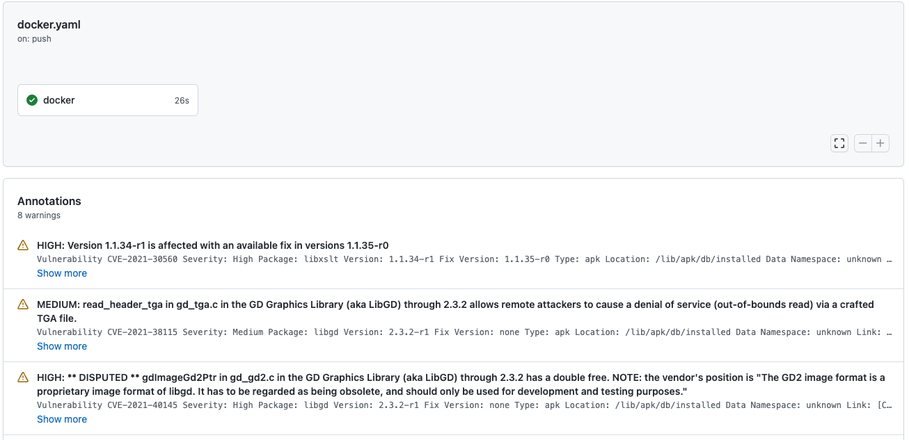

# Sarif Report Parse

If you'd like to see [Anchore Scan Action](https://github.com/anchore/scan-action)'s result, you could either upgrade your Github plan to Enterpise and activate Automated Code Scanning (ACS) or you use this action:


## Usage

Just include the action in your workflow like this:

```yaml
jobs:
  docker:
    timeout-minutes: 15
    runs-on: ubuntu-latest
    steps:
      - name: Login to GCR
        uses: docker/login-action@v1
        with:
          registry: eu.gcr.io
          username: _json_key
          password: ${{ secrets.GCR_JSON_KEY }}
      - name: Scan image
        id: scan
        uses: anchore/scan-action@v3
        with:
          image: ${IMAGE_NAME}
          fail-build: false
          debug: false
          acs-report-enable: true
      - name: Parse SARIF file
        uses: Miragon/sarif-report-parse@v1.0.3
        with:
          sarif-file: ${{ steps.scan.outputs.sarif }}
```

## Contributing

We are always welcoming new contributors that are helping to improve this action.

The [Open Source Guides](https://opensource.guide/) website has a lot of information for people and companies who are 
interested in how to run and contribute to an open source project. Contributors and people new to open source will find 
[this guide on how to contribute to Open Source](https://opensource.guide/how-to-contribute/) especially helpful.

There are many ways in which you can contribute to this repository, and not all of them require you to write code:

- **Use the action!** Test the action, check if edge cases are breaking them, and open issues if anything does not work 
  as expected or could be improved. Send us your feedback.
- **Read our documentation.** Is everything covered or are there any missing parts? Is there anything left unclear?
  Open an issue if anything is missing or wrong.
- **Check our open issues.** If there is any issue you would like to work on, feel free to fork the repository and 
  submit a pull request. If you need help, let us know, we're here to help.
  
## Development Notice

To create a new release, use the task `yarn dist`. It runs ESLint, clears the cache, and creates a distributable build
including all required dependencies using @vercel/ncc.

## License

Distributed under the Apache 2.0 License.

```
Copyright 2022 Miragon GmbH

Licensed under the Apache License, Version 2.0 (the "License");
you may not use this file except in compliance with the License.
You may obtain a copy of the License at

http://www.apache.org/licenses/LICENSE-2.0

Unless required by applicable law or agreed to in writing, software
distributed under the License is distributed on an "AS IS" BASIS,
WITHOUT WARRANTIES OR CONDITIONS OF ANY KIND, either express or implied.
See the License for the specific language governing permissions and
limitations under the License.
```
